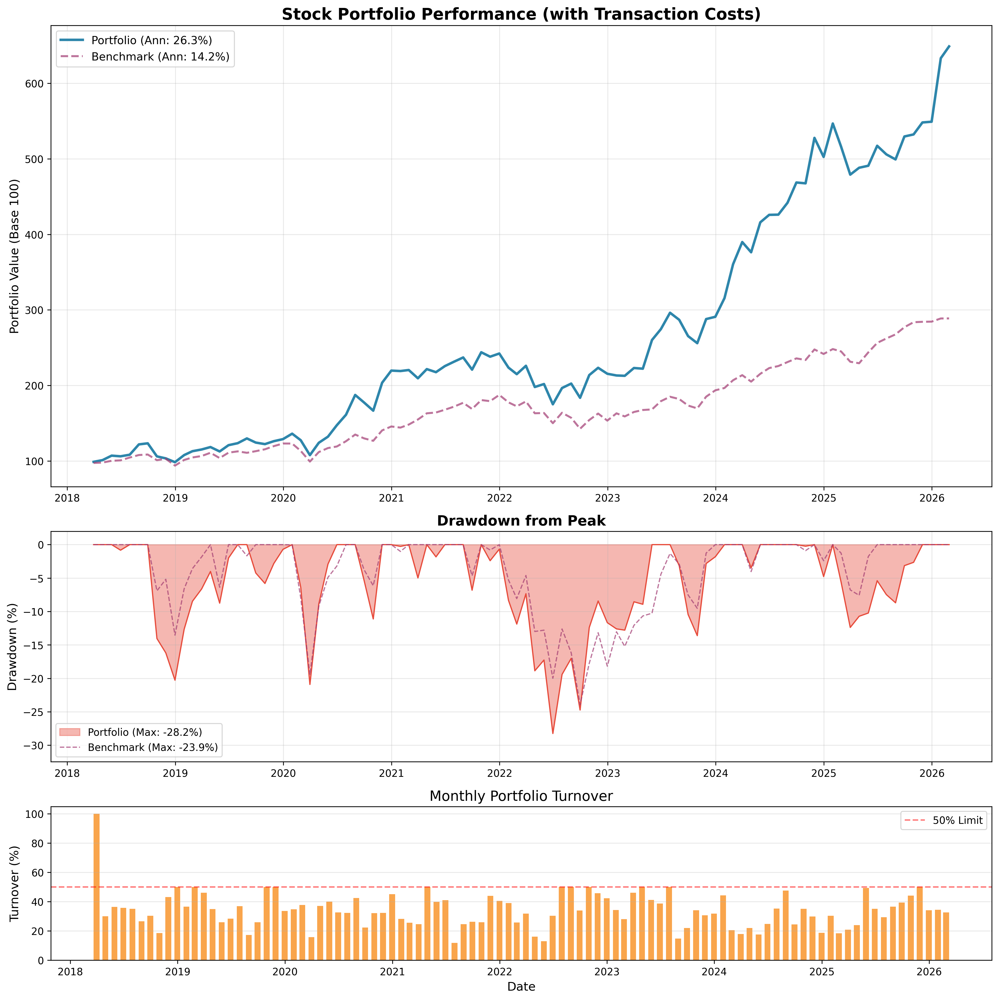

# 📈 Quantitative Stock Portfolio Manager

A fully automated, factor-based stock selection and portfolio construction system built in Python. The strategy selects stocks from the S&P 500 universe using **Fama-French 5-Factor alpha filtering**, **cross-sectional momentum**, and **inverse-volatility weighting**, then manages a concentrated, sector-constrained portfolio with realistic transaction costs and turnover limits.

---

## Table of Contents

- [Strategy Overview](#strategy-overview)
- [How It Works — Step by Step](#how-it-works--step-by-step)
  - [1. Universe & Data Download](#1-universe--data-download)
  - [2. Fama-French 5-Factor Alpha Filter](#2-fama-french-5-factor-alpha-filter)
  - [3. Momentum Scoring (12-1)](#3-momentum-scoring-12-1)
  - [4. Portfolio Weight Construction](#4-portfolio-weight-construction)
  - [5. Sector Constraints](#5-sector-constraints)
  - [6. Turnover Constraints & Transaction Costs](#6-turnover-constraints--transaction-costs)
  - [7. Backtesting Engine](#7-backtesting-engine)
- [Monte Carlo Simulations](#monte-carlo-simulations)
  - [Bootstrap Monte Carlo (Forward Projection)](#bootstrap-monte-carlo-forward-projection)
  - [Robustness Monte Carlo (Weight Perturbation)](#robustness-monte-carlo-weight-perturbation)
- [Telegram Alerts](#telegram-alerts)
- [Backtest Results](#backtest-results)
- [Output Files](#output-files)
- [Project Structure](#project-structure)
- [Configuration](#configuration)
- [Installation & Usage](#installation--usage)
- [Disclaimer](#disclaimer)

---

## Strategy Overview

The core idea is simple: **buy the S&P 500 stocks that have generated genuine alpha (after controlling for all five Fama-French factors), rank them by risk-adjusted momentum, and hold a concentrated portfolio with hard sector caps.**

| Feature | Detail |
|---|---|
| Universe | S&P 500 (~500 stocks) |
| Rebalancing | Monthly |
| Selection filter | Rolling 36-month Fama-French 5-Factor alpha > 0 |
| Ranking signal | 12-1 month momentum / 12-month rolling volatility |
| Weighting | Momentum-volatility score, normalized |
| Position limits | 5 %–20 % per stock, ~9–20 holdings |
| Sector caps | Configurable per GICS sector |
| Turnover cap | 50 % per month |
| Transaction costs | Bid-ask spread + commissions + market impact |
| Benchmark | SPY (S&P 500 ETF) |

---

## How It Works — Step by Step

### 1. Universe & Data Download

The system scrapes the current S&P 500 constituent list from Wikipedia, including each ticker's GICS sector classification. It then batch-downloads daily adjusted close prices for all ~503 tickers via `yfinance` and pulls the **Fama-French 5-Factor** daily dataset directly from Kenneth French's data library. Tickers with more than 20 % missing data are automatically dropped.

### 2. Fama-French 5-Factor Alpha Filter

For each month in the backtest, a **rolling 36-month OLS regression** is run for every stock:

```
R_i - R_f = α + β₁(Mkt-RF) + β₂(SMB) + β₃(HML) + β₄(RMW) + β₅(CMA) + ε
```

Only stocks with **α > 0** (positive intercept after controlling for market, size, value, profitability, and investment factors) pass through to the next stage. This ensures the strategy is not just picking up well-known factor exposures — it targets genuine, unexplained outperformance.

Across the backtest period, roughly 180–320 stocks pass this filter in any given month.

### 3. Momentum Scoring (12-1)

For the stocks that survive the alpha filter, a classic **12-minus-1 month momentum** signal is calculated:

```
Momentum = cumulative return from month t-12 to t-2
```

The most recent month (t-1) is excluded to avoid the short-term reversal effect documented in the academic literature.

### 4. Portfolio Weight Construction

Weights are assigned proportionally to a **momentum-to-volatility ratio**:

```
Score_i = max(Momentum_i / Volatility_i, 0)
Weight_i = Score_i / Σ Score_j
```

Where volatility is a 12-month rolling standard deviation of monthly returns. This effectively implements risk-adjusted momentum, tilting toward stocks with strong trends and lower recent volatility.

Weights are then:
- Capped by position count (max positions = 1 / min_weight, e.g., 20 positions at 5 % minimum)
- Filtered so that positions below 80 % of the minimum weight are dropped
- **Rounded to integer percentages** (e.g., 7 %, 11 %, not 7.3 %) for practical tradability

### 5. Sector Constraints

Each GICS sector has a maximum allocation cap. Defaults:

| Sector | Max Allocation |
|---|---|
| Information Technology | 50 % |
| Health Care | 25 % |
| Consumer Discretionary | 20 % |
| Financials | 15 % |
| All other sectors | 10 % each |

Within each sector, the maximum number of stocks is `sector_cap / min_weight`. For example, with a 10 % sector cap and 5 % minimum weight, a sector can hold at most 2 stocks. The sector filter preserves the alpha-ranked ordering, keeping only the top-ranked stocks per sector.

### 6. Turnover Constraints & Transaction Costs

#### Turnover Constraint

To prevent excessive trading, a **maximum monthly turnover** of 50 % is enforced. Turnover is defined as:

```
Turnover = Σ |w_new - w_old| / 2
```

When the desired rebalance would exceed this limit, trades are proportionally scaled back. A minimum trade threshold of 1 % prevents tiny, uneconomical trades. Over the full backtest, the constraint was binding in **11 out of 97 rebalances**, with an average realized turnover of ~34 %.

#### Transaction Costs

Four cost components are modeled:

| Component | Default Value |
|---|---|
| Bid-ask spread | 5 bps (0.05 %) per trade |
| Commission per trade | $1.00 fixed |
| Commission per share | $0.005 per share |
| Market impact | 1 bp per 1 % of portfolio traded |

These are applied to every weight change at each rebalance. Over the full backtest, cumulative transaction costs were **5.90 %**, or roughly **6 bps per rebalance**.

### 7. Backtesting Engine

The backtest follows a standard monthly rebalance protocol:

1. At the end of each month, new target weights are computed using data available up to that point (no lookahead bias).
2. Portfolio drift from the previous month is accounted for before computing trades.
3. Turnover constraints and transaction costs are applied.
4. The portfolio return for the following month is the weighted sum of constituent returns.
5. An equity curve is built starting from a base value of 100.

Performance metrics computed include annualized return, Sharpe ratio, Sortino ratio, maximum drawdown (with peak and recovery dates), and the Calmar ratio.

---

## Monte Carlo Simulations

The system includes two separate Monte Carlo analyses to stress-test the strategy from different angles.

### Bootstrap Monte Carlo (Forward Projection)

This answers the question: **"Given what we've seen historically, what range of outcomes should we expect going forward?"**

The engine takes the 96 observed monthly portfolio returns and performs **10,000 bootstrap simulations**, each drawing 120 months (10 years) of returns with replacement. No parametric distribution is assumed — the resampled paths inherit the actual skewness and kurtosis of the historical returns.

For each simulated path, the system computes terminal value, annualized return, and maximum drawdown.

<!-- Placeholder for Bootstrap Monte Carlo plot -->


**Key results (10,000 simulations, 10-year horizon):**

| Metric | Value |
|---|---|
| Mean annualized return | 30.23 % |
| Median annualized return | 26.35 % |
| Median terminal value (base 100) | 1,036.61 |
| Probability of loss after 10 years | 0.1 % |
| Probability of doubling | 98.3 % |
| Value at Risk (5 %) | 289.40 |
| CVaR (5 %) | 214.76 |
| Median max drawdown | −30.0 % |
| 5th–95th percentile range | 289.40 – 3,716.71 |

### Robustness Monte Carlo (Weight Perturbation)

This answers a different question: **"How sensitive are the results to the exact stock picks?"**

The engine runs **200 full strategy re-simulations**, each time injecting 20 % Gaussian noise into the momentum scores and shuffling alpha rankings proportionally. This means each simulation picks a slightly different portfolio, tests a slightly different weighting, and produces a slightly different equity curve — all while keeping the same fundamental methodology.

<!-- Placeholder for Robustness Monte Carlo plot -->


**Key results (200 simulations, 20 % noise):**

| Metric | Value |
|---|---|
| Original (unperturbed) annual return | 26.34 % |
| Mean perturbed annual return | 26.01 % |
| Standard deviation across sims | 1.54 % |
| 5th–95th percentile range | 23.57 % – 28.91 % |
| Worst case | 21.48 % |
| Best case | 30.34 % |
| Mean Sharpe | 1.04 |
| % of simulations with > 15 % annual return | 100 % |
| % of simulations with > 20 % annual return | 100 % |

**Verdict: HIGHLY ROBUST** — the strategy's alpha survives 20 % noise in 100 % of cases, with a median perturbed return equal to 99 % of the original.

---

## Telegram Alerts

After each run, the system sends a **Telegram message** with the current month's target holdings and weights. This is designed for practical use: run the script on the first trading day of each month, receive the new portfolio on your phone, and rebalance your brokerage account accordingly.

1. Create a bot with [@BotFather](https://t.me/botfather)
2. Get your bot token
3. Find your chat ID (use [@userinfobot](https://t.me/userinfobot))
4. Update `config.py`:
   ```python
   TELEGRAM_ENABLED = True
   TELEGRAM_TOKEN = "your_bot_token"
   TELEGRAM_CHAT_ID = "your_chat_id"
   ```

---

## Backtest Results

**Period:** January 2015 – February 2026 (~11 years)

<!-- Placeholder for performance plot -->


### Performance Summary

| Metric | Strategy | SPY Benchmark |
|---|---|---|
| Total return | 548.93 % | — |
| Annualized return | 26.34 % | 14.17 % |
| Sharpe ratio | 1.06 | — |
| Sortino ratio | 1.92 | — |
| Max drawdown | −28.24 % | — |
| Drawdown peak | Oct 2021 | — |
| Drawdown trough | Jun 2022 | — |
| Recovery | May 2023 (11 months) | — |
| Calmar ratio | 0.93 | — |
| **Alpha vs. SPY** | **+12.17 %** | — |

### Transaction Cost Summary

| Metric | Value |
|---|---|
| Total cumulative costs | 5.90 % |
| Average cost per rebalance | 6.15 bps |
| Average monthly turnover | 34.3 % |
| Turnover-constrained rebalances | 11 / 97 |

### Current Portfolio (February 2026)

| # | Ticker | Weight |
|---|---|---|
| 1 | NEM | 20 % |
| 2 | WDC | 15 % |
| 3 | FIX | 12 % |
| 4 | STX | 11 % |
| 5 | MU | 11 % |
| 6–9 | Others | 31 % |

The portfolio typically holds **8–12 stocks** at any given time, resulting in a concentrated, high-conviction portfolio.

---

## Output Files

Each run produces the following:

| File | Contents |
|---|---|
| `portfolio_results.xlsx` | Equity curve, benchmark, monthly returns, weights history, performance metrics |
| `portfolio_performance.png` | Strategy vs. benchmark equity curve chart |
| `monte_carlo_simulation.png` | Bootstrap MC fan chart with percentile envelopes |
| `monte_carlo_results.xlsx` | Full MC simulation data and statistics |
| `robustness_monte_carlo.png` | Robustness MC distribution plots |
| `robustness_monte_carlo_results.xlsx` | Full robustness simulation data |

---

## Project Structure

```
├── main.py                 # Orchestrator — runs the full pipeline
├── config.py               # All configurable parameters in one place
├── stock_picker.py         # Core strategy: data download, alpha filter, momentum,
│                           #   weight construction, sector filters, backtesting
├── portfolio_utils.py      # Backtest engine with transaction costs, turnover
│                           #   constraints, performance metrics, plotting
├── monte_carlo.py          # Bootstrap and robustness Monte Carlo engines
└── README.md
```

---

## Configuration

All parameters live in `config.py`. Key settings:

```python
# Backtest period
START_DATE = '2015-01-01'
END_DATE = datetime.now().strftime('%Y-%m-%d')

# Strategy
ALPHA_WINDOW = 36           # Months of rolling regression
MOMENTUM_LOOKBACK = 12      # Months for momentum signal
MIN_STOCK_WEIGHT = 0.05     # 5% minimum per position
REBALANCE_FREQUENCY = 1     # Monthly

# Risk management
MAX_MONTHLY_TURNOVER = 0.50 # 50% max turnover per rebalance
MIN_TRADE_THRESHOLD = 0.01  # Ignore weight changes < 1%

# Transaction costs
BID_ASK_SPREAD = 0.0005     # 5 bps
COMMISSION_PER_TRADE = 1.0  # $1 fixed
MARKET_IMPACT_FACTOR = 0.0001

# Monte Carlo
MC_N_SIMULATIONS = 10000    # Bootstrap paths
MC_HORIZON_MONTHS = 120     # 10-year projection
ROBUSTNESS_N_SIMULATIONS = 200
ROBUSTNESS_NOISE_SCALE = 0.20
```

---

## Installation & Usage

### Requirements

- Python 3.9+
- Dependencies: `pandas`, `numpy`, `yfinance`, `statsmodels`, `matplotlib`, `openpyxl`, `tqdm`, `requests`

### Install

```bash
pip install pandas numpy yfinance statsmodels matplotlib openpyxl tqdm requests
```

### Run

```bash
python main.py
```

The script will download all data, run the strategy, perform both Monte Carlo analyses, export results, generate plots, and send a Telegram alert — all in a single run. Typical runtime is 5–10 minutes depending on internet speed and machine performance (the robustness MC with 200 simulations is the bottleneck).

---

## Disclaimer

This project is for **educational and research purposes only**. Past performance does not guarantee future results. The backtest uses survivorship-biased S&P 500 constituents (current members applied retroactively) and does not account for delisted stocks. Always do your own due diligence before making investment decisions.
